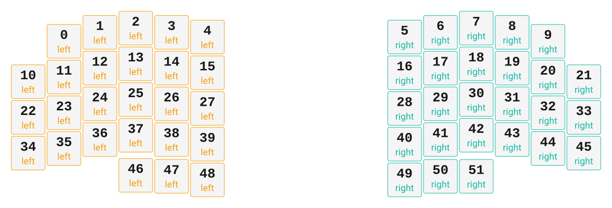

# ZMK Configuration for PhannyBall

*Generated by Shield Wizard for ZMK*



Download compiled firmware from the Actions tab. <https://zmk.dev/docs/user-setup#installing-the-firmware>

Edit your keymap <https://zmk.dev/docs/keymaps>.
User keymap is located at [`config/phannyball.keymap`](config/phannyball.keymap).

-----

<details>
<summary>
Shield Wizard Debug Information
</summary>

In case of broken configuration, here is the Shield Wizard internal data used to generate this configuration:

Commit: 5840d41ac0915092c8fe45da617ffb4bb91e1b97

```json
{"name":"PhannyBall","shield":"phannyball","dongle":false,"modules":[],"layout":[{"id":"01KR5EKKHS62PD0X3F4C320RJ5","part":0,"row":0,"col":1,"w":1,"h":1,"x":1,"y":0.37,"r":0,"rx":0,"ry":0},{"id":"01KR5EKKHSCKA77Y6N2VNZKDFJ","part":0,"row":0,"col":2,"w":1,"h":1,"x":2,"y":0.12,"r":0,"rx":0,"ry":0},{"id":"01KR5EKKHSH89ZYZK7TSQ2MR9C","part":0,"row":0,"col":3,"w":1,"h":1,"x":3,"y":0,"r":0,"rx":0,"ry":0},{"id":"01KR5EKKHS4K3FYPGG98QAK2V0","part":0,"row":0,"col":4,"w":1,"h":1,"x":4,"y":0.12,"r":0,"rx":0,"ry":0},{"id":"01KR5EKKHSY5WSRW1FSQP81X38","part":0,"row":0,"col":5,"w":1,"h":1,"x":5,"y":0.25,"r":0,"rx":0,"ry":0},{"id":"01KR5EKKHSXEJJVF6B1ZC2HYVF","part":1,"row":0,"col":8,"w":1,"h":1,"x":10.5,"y":0.25,"r":0,"rx":0,"ry":0},{"id":"01KR5EKKHSGKSS0PVS824N4FVD","part":1,"row":0,"col":9,"w":1,"h":1,"x":11.5,"y":0.12,"r":0,"rx":0,"ry":0},{"id":"01KR5EKKHS2RPNV4DK7G9F2YJX","part":1,"row":0,"col":10,"w":1,"h":1,"x":12.5,"y":0,"r":0,"rx":0,"ry":0},{"id":"01KR5EKKHSHS2XN6WBWDGN7CZN","part":1,"row":0,"col":11,"w":1,"h":1,"x":13.5,"y":0.12,"r":0,"rx":0,"ry":0},{"id":"01KR5EKKHSG5Y6C6GMYFFY11FV","part":1,"row":0,"col":12,"w":1,"h":1,"x":14.5,"y":0.37,"r":0,"rx":0,"ry":0},{"id":"01KR5EKKHSBC7A09M63Z6DHXCW","part":0,"row":1,"col":0,"w":1,"h":1,"x":0,"y":1.5,"r":0,"rx":0,"ry":0},{"id":"01KR5EKKHS5Y38MQVHXYJW9ECH","part":0,"row":1,"col":1,"w":1,"h":1,"x":1,"y":1.37,"r":0,"rx":0,"ry":0},{"id":"01KR5EKKHSQ1JREEGZJD7WA5RF","part":0,"row":1,"col":2,"w":1,"h":1,"x":2,"y":1.12,"r":0,"rx":0,"ry":0},{"id":"01KR5EKKHSPXY7G7SC7PHNVCDV","part":0,"row":1,"col":3,"w":1,"h":1,"x":3,"y":1,"r":0,"rx":0,"ry":0},{"id":"01KR5EKKHS1TN7BB2F6CCWEJK7","part":0,"row":1,"col":4,"w":1,"h":1,"x":4,"y":1.12,"r":0,"rx":0,"ry":0},{"id":"01KR5EKKHSJY7H54ZG59AAB7J3","part":0,"row":1,"col":5,"w":1,"h":1,"x":5,"y":1.25,"r":0,"rx":0,"ry":0},{"id":"01KR5EKKHS16B08A01P5RQAC6X","part":1,"row":1,"col":8,"w":1,"h":1,"x":10.5,"y":1.25,"r":0,"rx":0,"ry":0},{"id":"01KR5EKKHSKDN0XMEJP7V2KDJW","part":1,"row":1,"col":9,"w":1,"h":1,"x":11.5,"y":1.12,"r":0,"rx":0,"ry":0},{"id":"01KR5EKKHS4G0DBSEMQJWBCKE4","part":1,"row":1,"col":10,"w":1,"h":1,"x":12.5,"y":1,"r":0,"rx":0,"ry":0},{"id":"01KR5EKKHS3WHP7B14VT96GS9X","part":1,"row":1,"col":11,"w":1,"h":1,"x":13.5,"y":1.12,"r":0,"rx":0,"ry":0},{"id":"01KR5EKKHSP48F0DZ7VVPN1PHG","part":1,"row":1,"col":12,"w":1,"h":1,"x":14.5,"y":1.37,"r":0,"rx":0,"ry":0},{"id":"01KR5EKKHSH1RQ6NMDYVGEXFV4","part":1,"row":1,"col":13,"w":1,"h":1,"x":15.5,"y":1.5,"r":0,"rx":0,"ry":0},{"id":"01KR5EKKHSK7MVWHV9M7ATPNAX","part":0,"row":2,"col":0,"w":1,"h":1,"x":0,"y":2.5,"r":0,"rx":0,"ry":0},{"id":"01KR5EKKHS7WZD1M373EFMTBVX","part":0,"row":2,"col":1,"w":1,"h":1,"x":1,"y":2.37,"r":0,"rx":0,"ry":0},{"id":"01KR5EKKHS7YRRV2PZMW40BE25","part":0,"row":2,"col":2,"w":1,"h":1,"x":2,"y":2.12,"r":0,"rx":0,"ry":0},{"id":"01KR5EKKHSGTXZ58HJEYE793A3","part":0,"row":2,"col":3,"w":1,"h":1,"x":3,"y":2,"r":0,"rx":0,"ry":0},{"id":"01KR5EKKHSP1D4WMV0Z53QP46R","part":0,"row":2,"col":4,"w":1,"h":1,"x":4,"y":2.12,"r":0,"rx":0,"ry":0},{"id":"01KR5EKKHSX3C2F27ZH1D513KE","part":0,"row":2,"col":5,"w":1,"h":1,"x":5,"y":2.25,"r":0,"rx":0,"ry":0},{"id":"01KR5EKKHS0VTZ0SB7FPQSSTXG","part":1,"row":2,"col":8,"w":1,"h":1,"x":10.5,"y":2.25,"r":0,"rx":0,"ry":0},{"id":"01KR5EKKHSTTMKR0SRKAW0SGW7","part":1,"row":2,"col":9,"w":1,"h":1,"x":11.5,"y":2.12,"r":0,"rx":0,"ry":0},{"id":"01KR5EKKHS65EHZ8WF7ZDJ7N2Q","part":1,"row":2,"col":10,"w":1,"h":1,"x":12.5,"y":2,"r":0,"rx":0,"ry":0},{"id":"01KR5EKKHSN20DKVK6CBH5G6GN","part":1,"row":2,"col":11,"w":1,"h":1,"x":13.5,"y":2.12,"r":0,"rx":0,"ry":0},{"id":"01KR5EKKHS44X6N68XARZ434M3","part":1,"row":2,"col":12,"w":1,"h":1,"x":14.5,"y":2.37,"r":0,"rx":0,"ry":0},{"id":"01KR5EKKHS96XJ55MZXCG76XQW","part":1,"row":2,"col":13,"w":1,"h":1,"x":15.5,"y":2.5,"r":0,"rx":0,"ry":0},{"id":"01KR5EKKHSKN4TWKVJNZB88WNN","part":0,"row":3,"col":0,"w":1,"h":1,"x":0,"y":3.5,"r":0,"rx":0,"ry":0},{"id":"01KR5EKKHSFY5BFJT5FRRYYW5B","part":0,"row":3,"col":1,"w":1,"h":1,"x":1,"y":3.37,"r":0,"rx":0,"ry":0},{"id":"01KR5EKKHS56CW7HR8DZNEWD2T","part":0,"row":3,"col":2,"w":1,"h":1,"x":2,"y":3.12,"r":0,"rx":0,"ry":0},{"id":"01KR5EKKHS8HTF19CN351XZBZ5","part":0,"row":3,"col":3,"w":1,"h":1,"x":3,"y":3,"r":0,"rx":0,"ry":0},{"id":"01KR5EKKHSV59HX2F3PNS49ET8","part":0,"row":3,"col":4,"w":1,"h":1,"x":4,"y":3.12,"r":0,"rx":0,"ry":0},{"id":"01KR5EKKHSCXR38KWEEYFDD3BT","part":0,"row":3,"col":5,"w":1,"h":1,"x":5,"y":3.25,"r":0,"rx":0,"ry":0},{"id":"01KR5EKKHSKTJACXZ3VTZABQ4R","part":1,"row":3,"col":8,"w":1,"h":1,"x":10.5,"y":3.25,"r":0,"rx":0,"ry":0},{"id":"01KR5EKKHS97Y5MGEH3250N917","part":1,"row":3,"col":9,"w":1,"h":1,"x":11.5,"y":3.12,"r":0,"rx":0,"ry":0},{"id":"01KR5EKKHSF6AGFA6KTVBDBYGW","part":1,"row":3,"col":10,"w":1,"h":1,"x":12.5,"y":3,"r":0,"rx":0,"ry":0},{"id":"01KR5EKKHSR1WNAJKBNVJ6S7ZV","part":1,"row":3,"col":11,"w":1,"h":1,"x":13.5,"y":3.12,"r":0,"rx":0,"ry":0},{"id":"01KR5EKKHSX11ARW4X11EM7F0D","part":1,"row":3,"col":12,"w":1,"h":1,"x":14.5,"y":3.37,"r":0,"rx":0,"ry":0},{"id":"01KR5EKKHS3FRVT12XB9Y31V8D","part":1,"row":3,"col":13,"w":1,"h":1,"x":15.5,"y":3.5,"r":0,"rx":0,"ry":0},{"id":"01KR5EKKHSAYF1EVRP6EGM9RTD","part":0,"row":4,"col":3,"w":1,"h":1,"x":3,"y":4.12,"r":0,"rx":0,"ry":0},{"id":"01KR5EKKHSBXTPVAHEPZHC2ZB8","part":0,"row":4,"col":4,"w":1,"h":1,"x":4,"y":4.15,"r":0,"rx":0,"ry":0},{"id":"01KR5EKKHS39AGCMEC0VZB8GVK","part":0,"row":4,"col":5,"w":1,"h":1,"x":5,"y":4.25,"r":0,"rx":0,"ry":0},{"id":"01KR5EKKHSTH3BWXWA9Z6GNNND","part":1,"row":4,"col":8,"w":1,"h":1,"x":10.5,"y":4.25,"r":0,"rx":0,"ry":0},{"id":"01KR5EKKHS0T6DP9RV5ZCD8EZW","part":1,"row":4,"col":9,"w":1,"h":1,"x":11.5,"y":4.15,"r":0,"rx":0,"ry":0},{"id":"01KR5EKKHS510QB0QR0BW1RGJ8","part":1,"row":4,"col":10,"w":1,"h":1,"x":12.5,"y":4.15,"r":0,"rx":0,"ry":0}],"parts":[{"name":"left","controller":"nice_nano_v2","wiring":"matrix_diode","pins":{"d18":"input","d9":"input","d8":"input","d7":"input","d6":"input","d5":"input","d1":"output","d0":"output","d2":"output","d3":"output","d4":"output"},"keys":{"01KR5EKKHSJJ66KEVX8NQ78E86":{"input":"d18","output":"d1"},"01KR5EKKHSBC7A09M63Z6DHXCW":{"input":"d18","output":"d0"},"01KR5EKKHSK7MVWHV9M7ATPNAX":{"input":"d18","output":"d2"},"01KR5EKKHSKN4TWKVJNZB88WNN":{"input":"d18","output":"d3"},"01KR5EKKHS62PD0X3F4C320RJ5":{"input":"d9","output":"d1"},"01KR5EKKHS5Y38MQVHXYJW9ECH":{"input":"d9","output":"d0"},"01KR5EKKHS7WZD1M373EFMTBVX":{"input":"d9","output":"d2"},"01KR5EKKHSFY5BFJT5FRRYYW5B":{"input":"d9","output":"d3"},"01KR5EKKHSCKA77Y6N2VNZKDFJ":{"input":"d8","output":"d1"},"01KR5EKKHSQ1JREEGZJD7WA5RF":{"input":"d8","output":"d0"},"01KR5EKKHS7YRRV2PZMW40BE25":{"input":"d8","output":"d2"},"01KR5EKKHS56CW7HR8DZNEWD2T":{"input":"d8","output":"d3"},"01KR5EKKHSH89ZYZK7TSQ2MR9C":{"input":"d7","output":"d1"},"01KR5EKKHSPXY7G7SC7PHNVCDV":{"input":"d7","output":"d0"},"01KR5EKKHSGTXZ58HJEYE793A3":{"input":"d7","output":"d2"},"01KR5EKKHS8HTF19CN351XZBZ5":{"input":"d7","output":"d3"},"01KR5EKKHSAYF1EVRP6EGM9RTD":{"input":"d7","output":"d4"},"01KR5EKKHS4K3FYPGG98QAK2V0":{"input":"d6","output":"d1"},"01KR5EKKHS1TN7BB2F6CCWEJK7":{"input":"d6","output":"d0"},"01KR5EKKHSP1D4WMV0Z53QP46R":{"input":"d6","output":"d2"},"01KR5EKKHSV59HX2F3PNS49ET8":{"input":"d6","output":"d3"},"01KR5EKKHSBXTPVAHEPZHC2ZB8":{"input":"d6","output":"d4"},"01KR5EKKHSY5WSRW1FSQP81X38":{"input":"d5","output":"d1"},"01KR5EKKHSJY7H54ZG59AAB7J3":{"input":"d5","output":"d0"},"01KR5EKKHSX3C2F27ZH1D513KE":{"input":"d5","output":"d2"},"01KR5EKKHSCXR38KWEEYFDD3BT":{"input":"d5","output":"d3"},"01KR5EKKHS39AGCMEC0VZB8GVK":{"input":"d5","output":"d4"}},"encoders":[],"buses":[{"name":"spi0","devices":[],"type":"spi"},{"name":"spi1","devices":[],"type":"spi"},{"name":"spi2","devices":[],"type":"spi"},{"name":"spi3","devices":[],"type":"spi"},{"name":"i2c0","devices":[],"type":"i2c"},{"name":"i2c1","devices":[],"type":"i2c"}]},{"name":"right","controller":"nice_nano_v2","wiring":"matrix_diode","pins":{"d1":"output","d0":"output","d2":"output","d3":"output","d4":"output","d5":"input","d6":"input","d7":"input","d8":"input","d9":"input","d18":"input"},"keys":{"01KR5EKKHSXEJJVF6B1ZC2HYVF":{"input":"d5","output":"d1"},"01KR5EKKHSGKSS0PVS824N4FVD":{"input":"d6","output":"d1"},"01KR5EKKHS2RPNV4DK7G9F2YJX":{"input":"d7","output":"d1"},"01KR5EKKHSHS2XN6WBWDGN7CZN":{"input":"d8","output":"d1"},"01KR5EKKHSG5Y6C6GMYFFY11FV":{"input":"d9","output":"d1"},"01KR5EKKHSVRC2RM07N6Z104B4":{"input":"d18","output":"d1"},"01KR5EKKHS16B08A01P5RQAC6X":{"input":"d5","output":"d0"},"01KR5EKKHSKDN0XMEJP7V2KDJW":{"input":"d6","output":"d0"},"01KR5EKKHS4G0DBSEMQJWBCKE4":{"input":"d7","output":"d0"},"01KR5EKKHS3WHP7B14VT96GS9X":{"input":"d8","output":"d0"},"01KR5EKKHSP48F0DZ7VVPN1PHG":{"input":"d9","output":"d0"},"01KR5EKKHSH1RQ6NMDYVGEXFV4":{"input":"d18","output":"d0"},"01KR5EKKHS0VTZ0SB7FPQSSTXG":{"input":"d5","output":"d2"},"01KR5EKKHSTTMKR0SRKAW0SGW7":{"input":"d6","output":"d2"},"01KR5EKKHS65EHZ8WF7ZDJ7N2Q":{"input":"d7","output":"d2"},"01KR5EKKHSN20DKVK6CBH5G6GN":{"input":"d8","output":"d2"},"01KR5EKKHS44X6N68XARZ434M3":{"input":"d9","output":"d2"},"01KR5EKKHS96XJ55MZXCG76XQW":{"input":"d18","output":"d2"},"01KR5EKKHSKTJACXZ3VTZABQ4R":{"input":"d5","output":"d3"},"01KR5EKKHS97Y5MGEH3250N917":{"input":"d6","output":"d3"},"01KR5EKKHSF6AGFA6KTVBDBYGW":{"input":"d7","output":"d3"},"01KR5EKKHSR1WNAJKBNVJ6S7ZV":{"input":"d8","output":"d3"},"01KR5EKKHSX11ARW4X11EM7F0D":{"input":"d9","output":"d3"},"01KR5EKKHS3FRVT12XB9Y31V8D":{"input":"d18","output":"d3"},"01KR5EKKHSTH3BWXWA9Z6GNNND":{"input":"d5","output":"d4"},"01KR5EKKHS0T6DP9RV5ZCD8EZW":{"input":"d6","output":"d4"},"01KR5EKKHS510QB0QR0BW1RGJ8":{"input":"d7","output":"d4"}},"encoders":[],"buses":[{"name":"spi0","devices":[],"type":"spi"},{"name":"spi1","devices":[],"type":"spi"},{"name":"spi2","devices":[],"type":"spi"},{"name":"spi3","devices":[],"type":"spi"},{"name":"i2c0","devices":[],"type":"i2c"},{"name":"i2c1","devices":[],"type":"i2c"}]}]}
```

</details>
